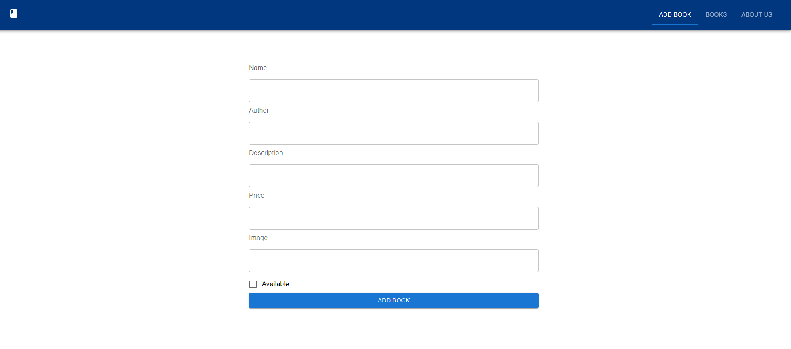

Book Library MERN App
===
## Tech Used: ReactJS | NodeJS | MongoDB

## Usage Guide

To Use Interact With this Project:

1. Open VSCODE or any code editor of your choice.

2. cd into Client Folder and Run:
```javascript=16
yarn Start
```
3. Open another Terminal, cd into Server Folder and Run:
```javascript=16
npm start
```
4. Add your own ENV Config Files


## NB:
Anyone can use to repository as they deem it Fit. I accept anyone to fork this repository and submit their own pull request.<br/>
Project Images Screenshots of the Application shall be below the Appendix and faq section.<br/>
Enjoy🎉<br/>

## Appendix and FAQ

:::info
**Find this Project incomplete? Or Having Some Errors** Kindly Submit an Issue!<br/>
made with ❤ amPhilip
:::<br/>
<br/>
<br/>
<br/>

